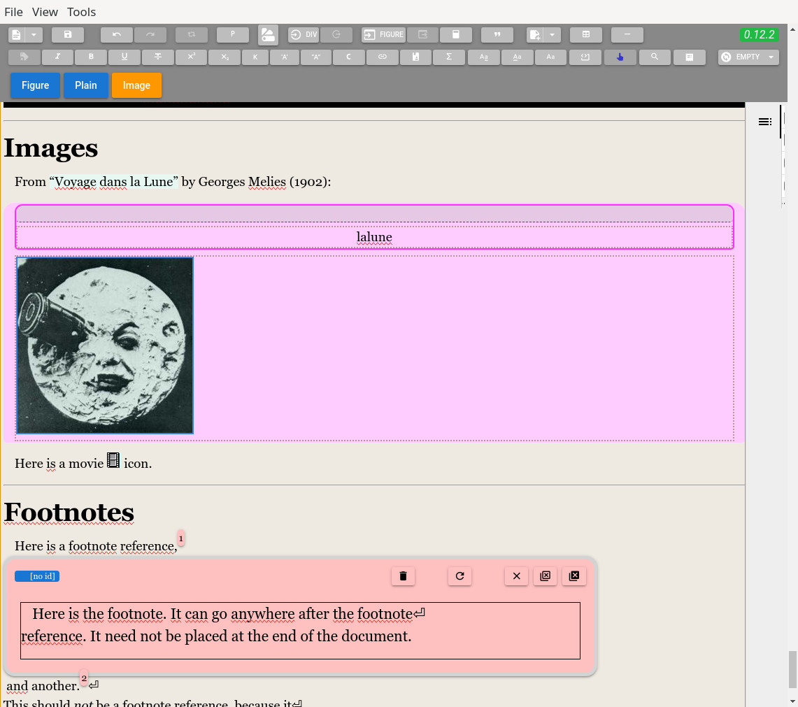
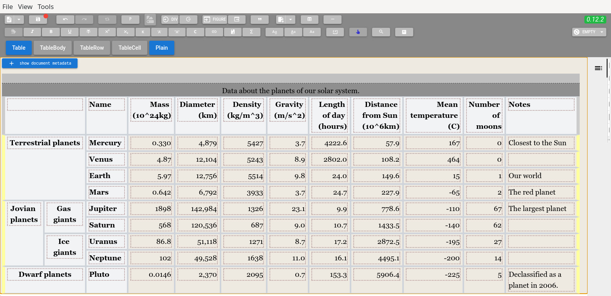

# A customizable editor for Pandoc types

This software is a visual editor for
[Pandoc's internal document model](https://hackage.haskell.org/package/pandoc-types-1.23.1/docs/Text-Pandoc-Definition.html),
that can be adapted to different document production workflows.

## Running the editor

I compile [two binaries](https://github.com/massifrg/pundok-editor/releases),
a Debian GNU/Linux `.deb` package and a Windows executable (no installation required),
both for the amd64 architecture.

The editor is coded in Typescript, so you need `npm` to download all the packages
it depends on, then compile it, and finally run it.

You also need `pandoc` (version 3 or later).
The editor works even without `pandoc`, but its functionality is limited.

If you use the GNU/Debian linux distribution, just as I do, don't use the older version
you get from the distro with `apt`; download `pandoc` from
[its repository](https://github.com/jgm/pandoc/releases) instead.

After cloning this repository and entering its main directory, type:

```sh
npm install
```

Then type:

```sh
npm run watch
```

to compile and run it as a standalone, [Electron](https://www.electronjs.org/)-based, app.

You may also use it as a web app with:

```sh
npm run dev
```

but it would be limited, since it would lack a proper backend on a server
(developing one is on the roadmap, though).

You can also package it:

```sh
npm run dist:deb
```

to have a Debian/Ubuntu installable package, or

```sh
npm run dist:win
```

to get a Windows executable file that does not need installation.

Those are the only two packages I was able to produce.
Making the Windows executable works even under my Debian,
with the help from the `wine` software.
If you know how to compile packages for other systems, e.g. for Macs, you are welcome.

## A couple of screenshots

This is a glimpse of the `test/testsuite.native` file in Pandoc's repository, opened in the editor:



Here's the rendering of `test/tables/planets.native`, from Pandoc's repository:



## What the editor does

This software is still in an alpha stage of development,
though you can do some real work with it.

The editor reads and writes Pandoc's JSON format natively,
but it can read and write any format supported by the version of Pandoc
you installed in your system, since it calls `pandoc` to make format conversions.

I would not advice you to use it to type your documents from scratch.
This editor, like Pandoc, is more about the semantic structure of texts.

These are some of the reasons you might find it useful:

- workflow and interface customizability:
  you can define, and access through the editor's GUI,
  [custom styles](https://pandoc.org/MANUAL.html#custom-styles),
  custom classes and attributes (for elements with an
  [Attr](https://hackage.haskell.org/package/pandoc-types-1.23/docs/Text-Pandoc-Definition.html#t:Attr));

- tools to edit Pandoc's tables and their attributes;

- tools to edit attributes of Blocks and Inlines, especially the `Attr` data structure;

- support for more than one kind of notes;

- a GUI to search and replace text, and CSS-like selection of elements of the Pandoc AST;

- storage and later retrieval of recurrent search-and-replace operations
  or CSS selections;

- automation of recurrent filters or format conversions involving Pandoc
  [readers and writers](https://pandoc.org/MANUAL.html#custom-readers-and-writers),
  [filters](https://pandoc.org/filters.html),
  [templates](https://pandoc.org/MANUAL.html#templates),
  [reference docs](https://pandoc.org/MANUAL.html#option--reference-doc);

- conventions and tools to organize a document in a tree structure
  through the inclusion of sub-documents (see the related
  [pandoc-include-doc](https://github.com/massifrg/pandoc-include-doc)
  project);

- conventions and tools for indexes (see the related
  [pandoc-export-index](https://github.com/massifrg/pandoc-export-index)
  project);

- document styling customizability through CSS files;

- custom automatic delimiters, like «...», “...”, ‘...’ for Pandoc quotations,
  `Quoted(DoubleQuote)` and `Quoted(SingleQuote)`;

- custom recurrent `RawInline` and `RawBlock` elements to be injected
  in your documents (e.g. I use the injection of raw elements to tune
  the typesetting with [ConTeXt](https://wiki.contextgarden.net));

- the result of running an external Pandoc filter on the document can be prepended,
  appended or overwritten to the document itself;

- custom conversions, text styles, CSS files, search/replace operations, CSS-like
  selections, indexes, delimiters, raw elements can be saved in configurations
  or project files, so that you can reconfigure the editor with all the tools
  you need for a particular workflow or project.

- while documentation, and a proper GUI to edit configurations files, are still lacking,
  you can take a look under these directories:

  - `packages/common/src/config/`

  - `staticResources/configs/`

  - `schemas/`

  to understand how configuration and project files are encoded.

### How it works

A Pandoc document is made of Blocks and Inlines.

The editor is based on Prosemirror, whose documents are made of Nodes and Marks.

So, essentially, the editor:

- transforms Pandoc's Blocks and Inlines from their JSON representation
  into Prosemirror's Nodes and Marks,

- lets the user manipulate the document changing Nodes and Marks,
  with tools that are adapted according to a configuration or a project file,

- saves the modified document transforming Prosemirror's Nodes and Marks
  back into Pandoc's Blocks and Inlines (and Meta).

At first glance Pandoc's Blocks match Prosemirror's Nodes and Inlines match Marks, but it's
not that simple, because the tree-like nature of Inlines does not perfectly match the flat,
label-like nature of [Marks in Prosemirror](https://prosemirror.net/docs/guide/#doc.structure).

## How the editor is made

The editor is based on the
[Vite+Electron+Vue](https://github.com/cawa-93/vite-electron-builder)
template by [Alex Kozack](https://github.com/cawa-93), though it's not kept in sync with it.

It's written in [Typescript](https://www.typescriptlang.org/)
and it uses
[Tiptap](https://tiptap.dev/),
[Prosemirror](https://prosemirror.net/),
[Vue](https://vuejs.org/),
[Electron](https://www.electronjs.org/) and
[Quasar](https://quasar.dev/) for its GUI.

It's structured to work as a standalone, Electron-based app, but also as an online editor.
Another possible incarnation would be a VS
[Code](https://code.visualstudio.com/)/[Codium](https://vscodium.com/) extension,
but it's not in my roadmap yet (if you are interested and have the skills, you're welcome).

The code base has no tests, and it evolved as a series of experiments
I made to see whether, and how I could implement some of the features listed above.
It also reflects my learning process of the softwares it relies on.

Euphemistically, let's say there's a lot of room for improvement in the quality of the code.

## Roadmap

The following are some of the tasks I plan to work on:

- support for citations, ~~that is almost absent now;~~ (basic support since v. 0.11.9)

- tools to edit and save configurations and project files;

- a server backend package for the browser version of the editor;

- a monorepo with sub-projects;

- the spin-off of a common package with base types and functions,
  to be imported by the main, renderer and server packages;

- a PDF preview.

## Related projects

These are other projects of mine that have been started to provide some features
to the editor:

- [pandoc-include-doc](https://github.com/massifrg/pandoc-include-doc) is a filter
  to include sub-documents with `Div.include-doc` elements, whose contents are replaced
  by the sub-document specified through attributes in the same `Div`;
  since the editor lives in a web page, it can't handle documents that are too long,
  so a tool to assemble smaller files was needed;

- [pandoc-export-index](https://github.com/massifrg/pandoc-export-index) is a collection
  of filters and custom writers to define and export indices to formats like ICML,
  docx and odt;

- [prosemirror-tables-sections](https://github.com/massifrg/prosemirror-tables-sections)
  is a fork of [prosemirror-tables](https://github.com/ProseMirror/prosemirror-tables)
  to make it usable for tables in Pandoc, which have sections (head, bodies and foot)
  and an optional caption; since the editor is based on [Prosemirror](https://prosemirror.net),
  I needed a component to edit Pandoc tables.
